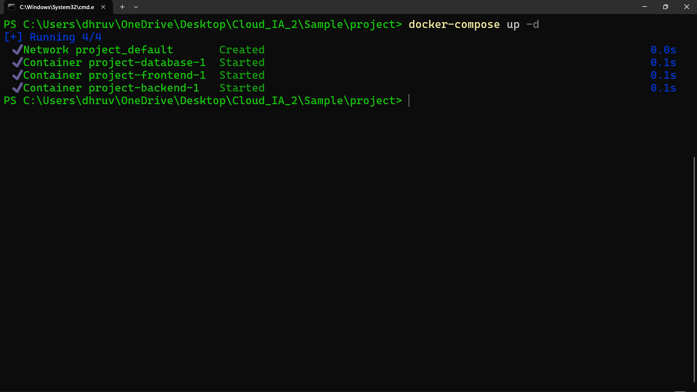
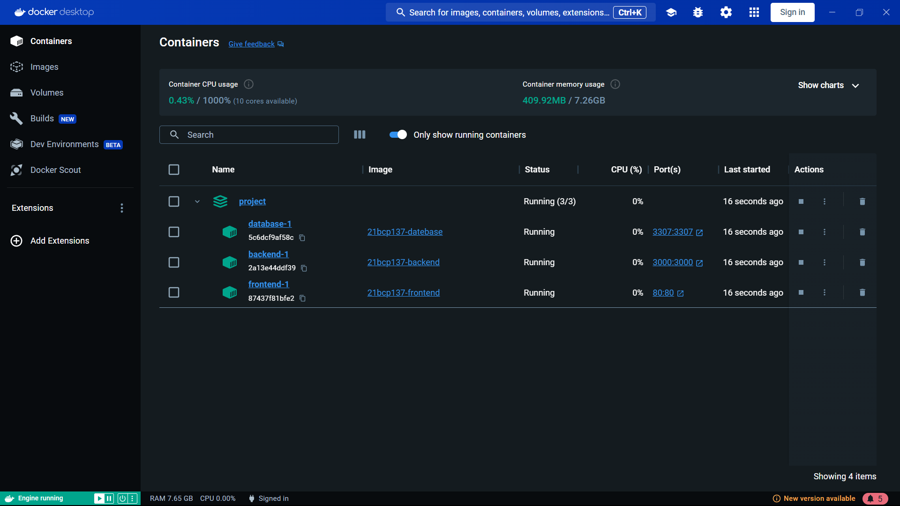
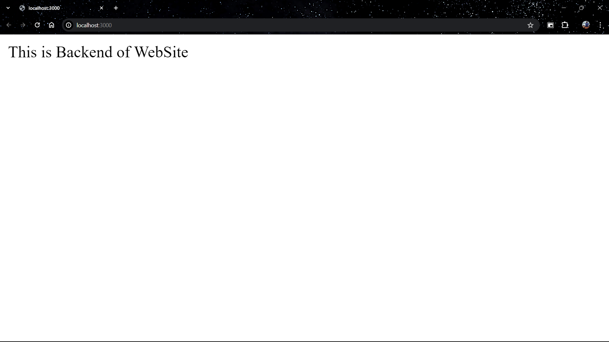
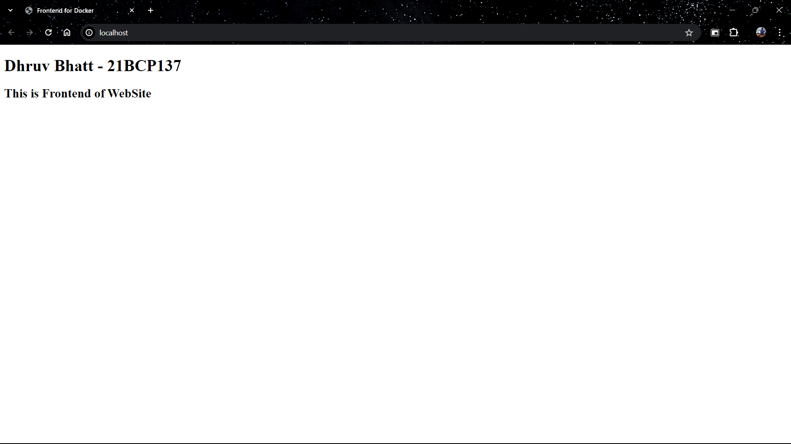
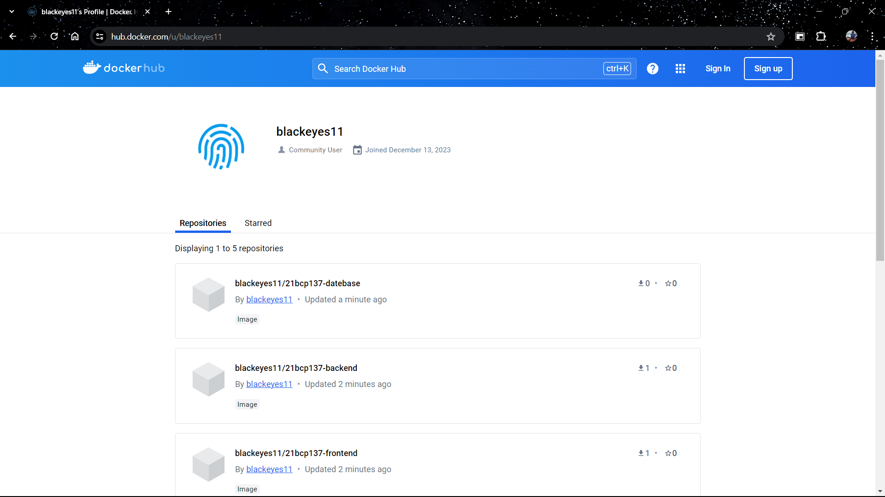
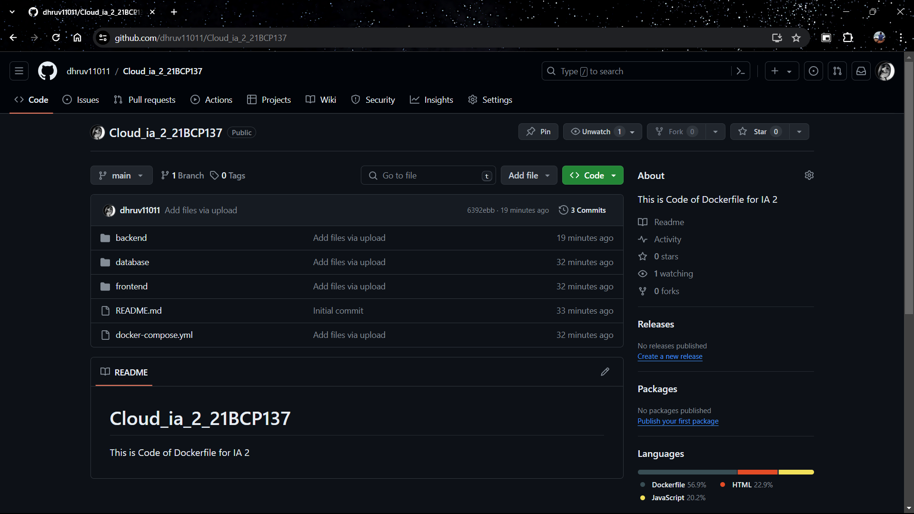

## Welcome to My First Blog Post!

{:height="350px" width="700px"}
_Scenario of a developer starting a blog_

## Why Github Pages?

As a developer, having a personal website to showcase your projects and share your thoughts is invaluable. After researching various blogging platforms like WordPress, Medium, and Ghost, I chose Github Pages with Jekyll for the following reasons:

1. **Full Control**: Customize your blog to your taste.
2. **Free Hosting**: No need to pay for hosting; Github Pages is free.
3. **Simplicity**: Simple, fast, and easy to maintain.

Feeling convinced? Let's dive into the steps to set up your own blog.

## Step 1: Choose Your Theme

Start by browsing through Jekyll themes on platforms like [Jekyll Themes](https://jekyllthemes.io/), [Jekyll Themes](http://jekyllthemes.org/), and [Jekyll Themes](https://jekyll-themes.com/). Pick a theme that fits your style and requirements. I personally chose the [Chirpy theme](https://github.com/cotes2020/chirpy-starter/) for its customization options and dark theme.

## Step 2: Activate Github Pages

Once you've selected a theme, it's time to host your blog on Github Pages. Follow these steps:

1. Use the template to create a new repository named `<your-gh-username>.github.io`.
2. Clone the repository to your local machine.
3. Install Ruby and Jekyll following the [official guide](https://jekyllrb.com/docs/installation/).
4. Run `bundle install` to install the required gems.
5. Update `_config.yml` with your site's details.
6. Run `bundle exec jekyll serve` to start the local server.

If you encounter any issues, refer to the theme's documentation for guidance.

## Overview

The application consists of the following components:

- **Frontend**: A simple HTML webpage.
- **Backend**: A Node.js server.
- **Database**: MySQL database.

## Prerequisites

Before getting started, ensure you have the following installed:

- Docker
- Docker Compose
- Docker Desktop

## Setup

1. **Clone the repository**:

  ```bash
  git clone https://github.com/dhruv11011/Cloud_ia_2_21BCP137
  ```

1. **Navigate to the project directory**:

  ```bash
  cd <project-folder>
  ```

1. **Navigate to the backend directory**:

  ```bash
  cd backend
  ```

1. **Navigate to the project directory again**:

  ```bash
  cd..
  ```
   
- Dockerfiles for Frontend, Database and Backend:

*Dockerfile(Frontend)*
```
# Use the official nginx image as base
FROM nginx:alpine

# Copy the HTML file to the default nginx public directory
COPY index.html /usr/share/nginx/html

# Expose port 80 to the outside world
EXPOSE 80
```


_Dockerfile(Database)_
```
# Use the official MongoDB image as base
FROM mysql:latest
```

_Dockerfile(Backend)_
```
# Use the official Node.js image as base
FROM node:14

# Set the working directory inside the container
WORKDIR /usr/src/app

# Copy package.json and package-lock.json to the working directory
COPY package*.json ./

# Install dependencies
RUN npm install

RUN npm install express

# Copy the rest of the application files to the working directory
COPY . .

# Expose port 3000 to the outside world
EXPOSE 3000

# Command to run the application
CMD ["node", "index.js"]
```


5. **Start the Docker containers**:

  ```bash
  docker-compose up -d
  ```

_docker-compose.yml_
```bash
version: '3.8'

services:
  frontend:
    image: 21bcp137-frontend
    ports:
      - "80:80"  # Assuming your frontend runs on port 80

  backend:
    image: 21bcp137-backend
    ports:
      - "3000:3000"  # Assuming your backend runs on port 3000
    depends_on:
      - database

  database:
    image:  21bcp137-datebase
    environment:
      - MYSQL_ROOT_PASSWORD=dhruv123
      - MYSQL_DATABASE=cloudia2
      - MYSQL_USER=dhruv
      - MYSQL_PASSWORD=dhruv123
    ports:
      - "3307:3307"  # Assuming your database runs on port 3307
```


{:height="350px" width="700px"}
_Docker Compose in CLI_

1. **Check into Docker Desktop Whether containers are running or not**:
{:height="350px" width="700px"}
_This showing all container running together_


8. **Frontend Server**:
{:height="350px" width="700px"}
_Output of Frontend Server_

9. **Backend Server**:
{:height="350px" width="700px"}
_Output of Backend Server_

## Additional Information

{:height="350px" width="700px"}
_Docker Repository_

{:height="350px" width="700px"}
_Github Repository_

### Backend Dependencies:

    - express
    - mysql
    - body-parser
    - nodemon (development only)
    - Database Initialization: The MySQL database is initialized with default data. You can modify the initialization script (init.sql) to customize the database schema or data.
